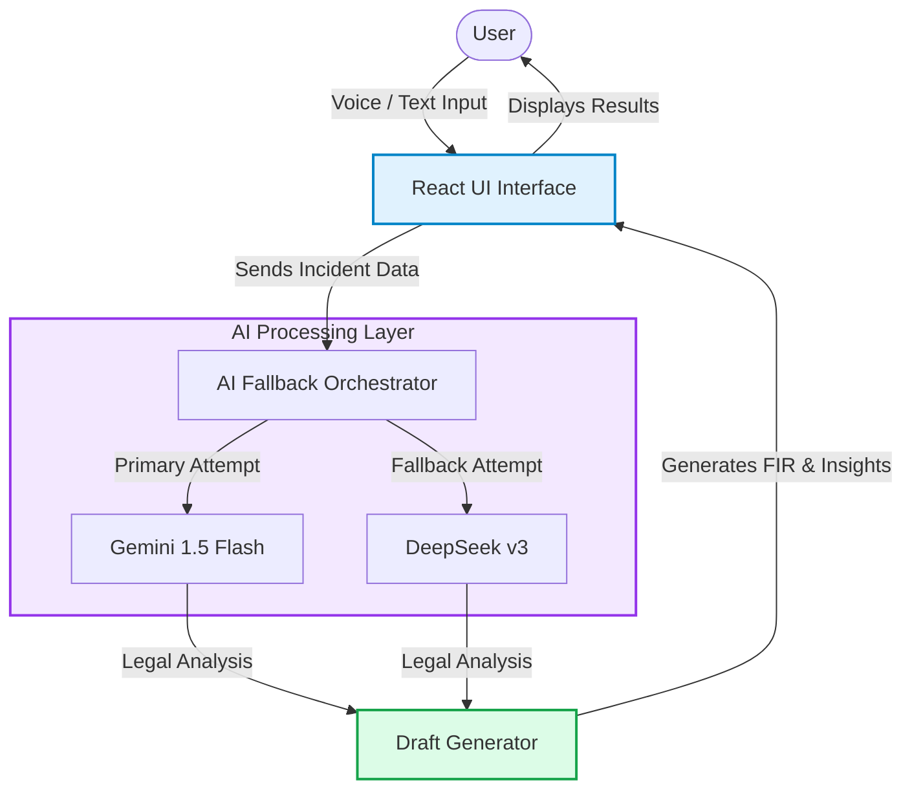

# ⚖️ Laws Navigator AI

**Laws Navigator** is an AI-powered legal assistant designed to help Indian citizens understand their legal rights and identify relevant laws (IPC, BNS, CrPC) for any given situation. It also features an automated FIR (First Information Report) draft generator to simplify the legal process for victims.

### 🔥 Key Features
- **Dual AI Engine**: Uses **Gemini 1.5 Flash** as primary and **DeepSeek v3** as a fallback for high availability.
- **Multilingual Support**: Supports English, Hindi, and Marathi for both input and analysis.
- **Voice-to-Law**: Built-in speech recognition for hands-free dictated legal inquiries.
- **FIR Generator**: Automatically drafts a professional FIR based on the incident description and identified sections.
- **BNS/IPC Mapping**: Ready for the transition to the Bharatiya Nyaya Sanhita (BNS).

### 🛠️ Tech Stack
- **Framework**: [React](https://react.dev/) + [Vite](https://vitejs.dev/)
- **Styling**: [Tailwind CSS](https://tailwindcss.com/)
- **Animations**: [Framer Motion](https://www.framer.com/motion/)
- **Icons**: [Lucide React](https://lucide.dev/)
- **AI Models**: Google Gemini & DeepSeek

## 🏗 System Architecture

The application utilizes a resilient AI pipeline, employing a primary-fallback model structure to ensure continuous availability even if one API rate-limits.



## 📂 File Structure

```text
laws-navigator/
├── public/            # Static assets
├── src/
│   ├── components/    # Reusable UI widgets (Voice input, Result cards)
│   ├── utils/         # AI API integrators and fallback handlers
│   ├── App.jsx        # Main routing and layout
│   └── main.jsx       # Entry point
├── .env.example       # Example environment configuration
├── package.json       # Project dependencies
└── README.md          # Documentation
```

### 🚀 Local Deployment

1. **Clone & Install**:
   ```bash
   npm install
   ```

2. **Set Environment Variables**:
   Create a `.env` file and add your keys:
   ```env
   VITE_GEMINI_API_KEY=your_key_here
   ```

3. **Run Dev Server**:
   ```bash
   npm run dev
   ```

### 🤝 Contributing
Contributions are welcome! Whether it's adding better legal templates or improving the AI prompt, feel free to fork and PR.

### ⚠️ Disclaimer
This application is for educational and informational purposes only. It is not a substitute for professional legal advice from a qualified advocate.

---
*Created by [Kartik Shete](https://github.com/kartikshete)*

<!-- Doc sync 2 -->
<!-- Doc sync 11 -->